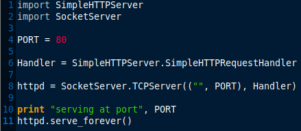

Authors
=======
Guillaume Daumas : guillaume.daumas@univ-tlse3.fr

Ahmad Samer Wazan : ahmad-samer.wazan@irit.fr

Intro
=====

This code implements a role based approach for distributing Linux capabilities into Linux users. It allows assigning Linux capabilities to Linux users without the need to inject the Linux capabilities into executable files. Our code is a PAM-based module that leverages a new capability set added to Linux kernel, called Ambient Set. Using this module, administrators can group a set of Linux capabilities in roles and give them to their users. For security reasons, users don’t get the attributed roles by default, they should activate them using the command sr (substitute role). Our module is compatible with pam_cap.so. So administrators can continue using pam_cap.so along with our module.

Tested Platforms
===========
Our module has been tested only on Ubuntu and Debian platforms.

Installation
===========

How to Build
------------

	1. git clone https://github.com/guillaumeDaumas/switchRole
    
    2. cd swithRole
    
    3. execute the following installation script as root :
		`sh ./buildSR.sh`
    
    4. restart your system.

Usage
-----

After the installation you will find a file called capabilityRole.conf in the /etc/security directory. You should configure this file in order to define the set of roles and assign them to users or group of users on your system.

Once configuration is done, a user can assume a role using the tool ‘sr’ that is installed with our package. In your shell type for example :

`./sr role1` 

After that a new shell is oppend that contains the capabilities in the role that has been taken by the user. You can verify by reading the capabilities of your shell (cat /proc/$$/status). When you exit you can retrun to your initial shell. 

**No Root**

You have the possibility to launch a full capabale shell that doesn't give any special treatment to uid 0. The root user is considered as any other normal user and you can in this case grant him a few privileges in the capabilitirole.conf distributed by our module :

`./sr -noroot role1`

We use the securebits to provide this functionality. Any set-uid-root program will be run without having any special effect. So in the shell, you can't for example use the ping command without a role that has cap_net_raw privilege.

Motivation scenarios
===========

Scenario 1
-----
A user contacts his administrator to give him a privilege that allows him running an HTTP server that is developed using Python. His script needs the privilege CAP_NET_BIND_SERVICE to bind the server socket to 80 port.  Without our module, the administrator has two options: (1)  Use setcap command to inject the privilege into Python interpreter or (2) use pam_cap.so to attribute the CAP_NET_BIND_SERVICE to the user and then inject this privilege in the inheritable and effective sets of the interpreter. Both solutions have security problems because in the case of option (1), the Python interpreter can be used by any another user with this privilege. In the case of option (2) other python scripts run by the legitimate user will have the same privilege.

Here a simple python script that needs to bind a server on the port 80 (the user running the script needs CAP_NET_BIND_SERVICE to do that).

If we try to execute the script without any privilege, we get the expected 'Permission denied'.

The first solution consists in using the setcap command in order to attribute the cap_net_bind_service capability to the python interpreter. Doing this create a security problem; now users present in the same system have the same privlidge. 

the second solution is to use pam_cap.so module. In this case all scripts run by the same user will have the same privilege.

Our solution provides a better alternative. Suppose that the capabilityRole.conf contains the follwing configuratiion:

                                  role1 cap_net_bind_service guillaume none 
Then the user needs only to assume role1 using our sr tool and then run its script. (S)he can use other shell to run the other non-privileged scripts.

And as we can see here, python binary doesn't have any capabilities.

Scenario 2 
-----
Suppose a developer wants to test a program that (s)he has developed in order to reduce the downloading rate on his server. The developer should use the LD_PRELOAD environment variable to load his shared library that intercepts all network calls made by the servers’ processes. With the current capabilities tools, the administrator of the server can use setcap command or pam_cap.so to give the developer cap_net_raw. However, the developer cannot achieve his test because, for security reasons, Linux kernel doesn’t take into account the capabilities stored in the binaries when LD_PRELOAD is configured.

Scenario 3 
-----
an administrator wants to attribute a user the privilege to run an apache server. Without our module, the administrator can use either setcap command to inject the necessary privilege in the binary of apache server (option1) or use pam_cap.so module and setcap command (option2). Both options have problems: All systems' users will get this privilege in the case of option 1. The configuration of the binary apache will be lost after updating the apache package.  

Scenario 4 
-----
Two developers create a shared folder in which they stored a common program that they develop together. This program requires cap_net_raw privilege. The developers have to mount their shared folder using NFS v3.  This scenario is not feasible with the current tools because NFS v3 doesn’t support extended attributes. 

How sr works
===========
You might be interested to know how we implement the sr tool. So here is the algorithm: 

In terms of capabilities calucations by Linux Kernel, here is what happens:

References
==========

PAM repository : https://github.com/linux-pam/linux-pam

libcap repository : https://github.com/mhiramat/libcap

Where I have found the simple Python code for HTTP server : https://docs.python.org/2/library/simplehttpserver.html

Very helpfull site, where you can find some informations about PAM, libcap and the capabilities:

Original paper about capabilities : https://pdfs.semanticscholar.org/6b63/134abca10b49661fe6a9a590a894f7c5ee7b.pdf

Article about the capabilities : https://lwn.net/Articles/632520/

Article about Ambient : https://lwn.net/Articles/636533/

Simple article with test code for Ambient : https://s3hh.wordpress.com/2015/07/25/ambient-capabilities/

Article about how PAM is working : https://artisan.karma-lab.net/petite-introduction-a-pam

A very helpfull code about how to create a PAM module : https://github.com/beatgammit/simple-pam
