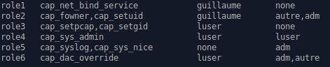
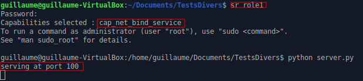
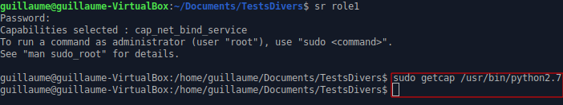

Authors
=======
Guillaume Daumas : guillaume.daumas@univ-tlse3.fr

Ahmad Samer Wazan : ahmad-samer.wazan@irit.fr

Intro
=====

This code implements a role based approach for distributing Linux capabilities into Linux users. It allows assigning Linux capabilities to Linux users without the need to inject the Linux capabilities into executable files. Our code is a PAM-based module that leverages a new capability set added to Linux kernel, called Ambient Set. Using this module, administrators can group a set of Linux capabilities in roles and give them to their users. For security reasons, users don’t get the attributed roles by default, they should activate them using the command sr (substitute role). Our module is compatible with pam_cap.so. So administrators can continue using pam_cap.so along with our module.

Tested Platforms
===========
Our module has been tested only on Ubuntu and Debian platforms.

Installation
===========

How to Build
------------

	1. git clone https://github.com/guillaumeDaumas/switchRole
    
    2. cd swithRole
    
    3. execute the following installation script as root :
		`sh ./buildSR.sh`
    
    4. restart your system.

Usage
-----

After the installation you will find a file called capabilityRole.conf in the /etc/security directory. You should configure this file in order to define the set of roles and assign them to users or group of users on your system.

Once configuration is done, a user can assume a role using the tool ‘sr’ that is installed with our package. In your shell type for example :

`./sr role1` 

After that a new shell is oppend that contains the capabilities in the role that has been taken by the user. You can verify by reading the capabilities of your shell (cat /proc/$$/status). When you exit you can retrun to your initial shell. 

**No Root**

An other possibility is to launch a bash without sudo possibility. You can use this mode like this:

`./sr -noroot role1`

You have activated the noroot and nosuid bits and the no_new_privs bit. It's now impossible to launch a command with sudo and the setuid bit in a binary is no longer effective. For example, you can't use the ping command without a role with cap_net_raw.
Other example : if you used `sr -noroot role` as root (with a role where root is allowed), the capabilities will drop to the match the role.

Motivation scenarios
===========

Scenario 1
-----
A user contacts his administrator to give him a privilege that allows him running an HTTP server that is developed using Python. His script needs the privilege CAP_NET_BIND_SERVICE to bind the server socket to 80 port.  Without our module, the administrator has two options: (1)  Use setcap command to inject the privilege into Python interpreter or (2) use pam_cap.so to attribute the CAP_NET_BIND_SERVICE to the user and then inject this privilege in the inheritable and effective sets of the interpreter. Both solutions have security problems because in the case of option (1), the Python interpreter can be used by any another user with this privilege. In the case of option (2) other python scripts run by the legitimate user will have the same privilege.

Here a simple python script wich bind a server on the port 80 (this port is normally reserved for the system).

If we try to use it, we have the expected 'Permission denied'.

First solution is to use to setcap command and attribute the cap_net_bind_service capability to the python interpreter. But, now all the script launch with python will have this capability.

Second solution is to use this module. First, you configure the capabilityRole.conf file : here I set cap_net_bind_service in the role1.

Then, we launch a new bash with sr and the role1, and we can launch our script without any problem !

And as we can see here, python binary doesn't have any capabilities.

How sr works
===========
You might be interested to know how we implement the sr tool. So here is the algorithm: 

In terms of capabilities calucations by Linux Kernel, here is what happens:

References
==========

PAM repository : https://github.com/linux-pam/linux-pam

libcap repository : https://github.com/mhiramat/libcap

Where I have found the simple Python code for HTTP server : https://docs.python.org/2/library/simplehttpserver.html

Very helpfull site, where you can find some informations about PAM, libcap and the capabilities:

Original paper about capabilities : https://pdfs.semanticscholar.org/6b63/134abca10b49661fe6a9a590a894f7c5ee7b.pdf

Article about the capabilities : https://lwn.net/Articles/632520/

Article about Ambient : https://lwn.net/Articles/636533/

Simple article with test code for Ambient : https://s3hh.wordpress.com/2015/07/25/ambient-capabilities/

Article about how PAM is working : https://artisan.karma-lab.net/petite-introduction-a-pam

A very helpfull code about how to create a PAM module : https://github.com/beatgammit/simple-pam
